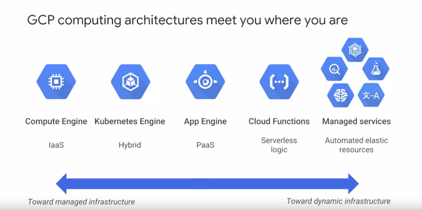
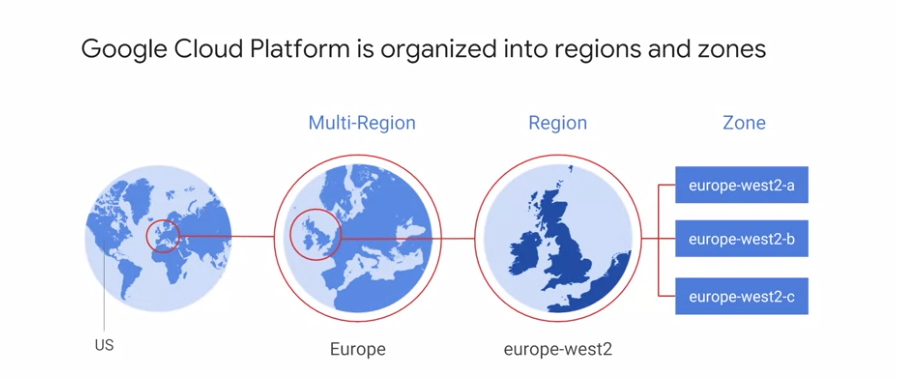
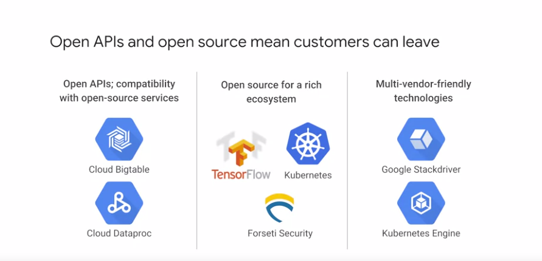
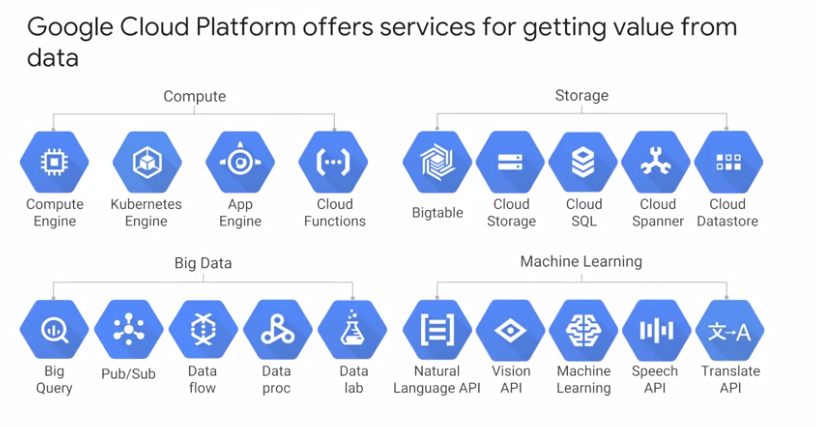
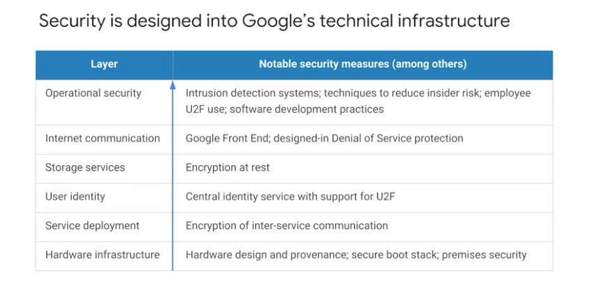

# GCP introduction

# important
- GCP use Edge caching to response the resuests faster.

# Zones

Think of a zone as a single failure domain within a region. As part of building a fault tolerant application, you can spread their resources across multiple zones in a region.

# Open APIs

# Offers

# Multi-layer security

