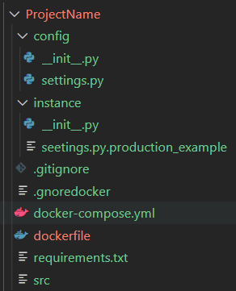

# Creating a Flask project 
A Flask project is not anything except a folder, which contains some folders and files.
The following figure demonstrate an empty Flask projects structure.

In this structure only the files and folders are created but they are all empty.